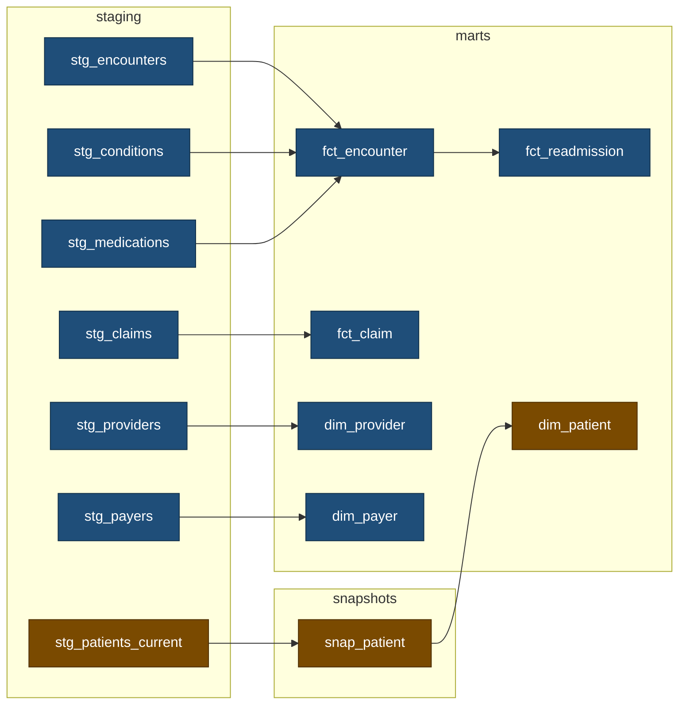

# Synthetic health warehouse

[](https://github.com/an-hill/synthetic-health-warehouse/actions/workflows/python-checks.yml) [](https://github.com/an-hill/synthetic-health-warehouse/actions/workflows/dbt.yml) [](https://github.com/an-hill/synthetic-health-warehouse/actions/workflows/airflow.yml)

An analytics pipeline over synthetic patient data: a windowed loader, a dbt star schema, and two Airflow DAGs. The domain was chosen for its awkwardness, and for my experience working in it. Claims arrive weeks after the visit they bill for, records get restated, and patient attributes change. That is what makes incremental models, snapshots, and idempotent backfills necessary.

Data is [Synthea](https://github.com/synthetichealth/synthea), generated once and committed as Parquet: 554 patients, 31,824 encounters, and 60,828 claims running to the end of 2025, so no Java is needed to run any of this. `data/README.md` holds the provenance and the shape.

## What it aims to show

Five problems a warehouse over a live source has to solve, and one decision each. [`docs/design-notes.md`](docs/design-notes.md) carries the reasoning and the measurements behind them.

- **Facts arrive late and get restated.** `fct_claim` decides whether to keep an arrival by comparing it against the row already stored for that same claim, so a re-landed or out-of-order window still resolves to one row per claim. The usual shortcut compares against the newest date anywhere in the table instead. It reads far less data, and it leaves 422 claims of 60,433 when the same windows land in reverse.
- **Children fan out from the parent.** Conditions, medications, and claims are aggregated to encounter grain before they join. A reconciliation test catches the version of the mistake that leaves every cost correct and only the counts wrong.
- **The source shows current state alone.** `snap_patient` is a type-2 snapshot rebuilding history one window at a time, guarded by a `pre_hook` that refuses a backwards as-of date, because a snapshot that has written a false row cannot be repaired.
- **A model can define a measure rather than reshape a table.** `fct_readmission` pins its boundary rules with unit tests, and its answer with a count taken from outside dbt.
- **Not every step can be rerun.** Two DAGs split on that property, because a snapshot accumulates where every other model rebuilds.

## Running it

Requires [uv](https://docs.astral.sh/uv/) and Python 3.13.

```sh
uv run python -m loader.land --window-start 1900-01-01 --window-end 2025-09-01 && make build
uv run python -m loader.land --window-start 2025-09-01 --window-end 2025-11-01 && make build
uv run python -m loader.land --window-start 2025-11-01 --window-end 2025-12-01 && make build
```

The first is the history load a pipeline runs on the day it is deployed. The other two are scheduled months. Building after each is what lets `snap_patient` record three separate as-of dates. The result is 31,611 encounters, 60,433 claims, and 567 patient versions over 554 patients.

`make` lists every target. The ones worth knowing:

- `make build` builds the models and runs their tests.
- `make freshness` checks how recently the loader last wrote each raw table.
- `make docs` serves the model documentation and lineage graph on localhost:8080.
- `make check-windows` asserts what the second and third windows above should have produced, against counts fixed outside the dbt project.
- `make check-all` runs lint, typecheck, and tests, in the order they fail fastest.

For the orchestrated version, `astro dev start` needs Docker and brings Airflow up on localhost:6563 against its own warehouse under `include/`.

## The warehouse



Blue is built by `health_warehouse` and amber by `patient_history`. The first runs monthly, landing a window and building every model but the snapshot's; the second runs the snapshot and `dim_patient`, triggered by an `Asset` the loader emits rather than by the clock. One Cosmos selector, `stg_patients_current+`, splits them. Airflow's data interval is a half-open date range exactly as `land_window` takes it, so the DAG does no date arithmetic of its own. The seven raw tables are one view each and are left out of the diagram.


Four files carry most of the design:

- `transform/models/marts/fct_claim.sql`, the incremental filter, and why it compares per claim.
- `transform/macros/refuse_a_backwards_as_of_date.sql`, prevention where the damage cannot be undone.
- `dags/warehouse.py`, the one selector that splits the two DAGs.
- `scripts/check_warehouse.py`, the counts checked outside dbt, standing in for reconciliation against a system of record.

## What of this would survive a real pipeline

**Unchanged.** The windowing contract, `land_window(start, end)` over a half-open interval, is how a real extract is parameterised from a scheduler's data interval. Delete on a partition predicate and then insert, all inside one transaction, is the idempotency and atomicity pattern any warehouse needs, and only the dialect changes. Deciding *which* date a row belongs to is a real decision that quietly breaks incremental models when it is wrong. Most of the tests survive too.

**Deleted.** The restatement injection and `meta.injection_log`, because a real source amends its own records. Apportioning the encounter's cost across its claims, which is needed only because the 216 MB transactions file holding the real charges was left out. And `patients_current`'s as-of resolution, since a production source already shows current state.

**Replaced.** Eight lines. Every `read_parquet` call is the place a source connector goes, and nothing around them changes.

Nothing backs up `warehouse.duckdb`, because it is derived and recovery means re-running the loader. That holds only because the source is immutable and complete. A real source ages records out, leaving the raw layer holding the only copy of what arrived. The usual answer is an immutable landing zone written once and never rewritten, and the committed Parquet is that in miniature.

## Limitations

- Synthea does not model readmission behaviour. Seven patients hold 20 or more inpatient stays and account for 110 of the 125 readmissions. The query is the deliverable. The rate is an artefact of the generator.
- A re-landed window can leave a stale row in `fct_claim`. Stated, not fixed.
- dbt tasks are serialised because DuckDB is single-writer. A real warehouse would not need it.
- The history load hides the pipeline's own ragged leading edge, so the claims orphan check reports zero.
- No production scale, no cloud warehouse, no operational history.

## Versions run on

| Component | Version |
|---|---|
| Python | 3.13 |
| DuckDB | 1.5.5 |
| dbt-core, dbt-duckdb | 1.12.0, 1.10.1 |
| Airflow | 3.3.0, from Astro Runtime 3.3-2 |
| astronomer-cosmos | 1.15.1 |

Locked in `uv.lock`. The Astro image installs the same dependency groups the Makefile uses.

## Licence

MIT, covering the code. The export under `data/` is the output of [Synthea](https://github.com/synthetichealth/synthea), copyright The MITRE Corporation and released under Apache 2.0. `data/README.md` carries the terminology notices that travel with it. It is synthetic throughout and holds no patient information, real or reconstructable.

## Assistance

Developed with the assistance of [Claude Code](https://claude.com/claude-code). Every line of code and text in this repository was written, directed, or reviewed by me personally.
