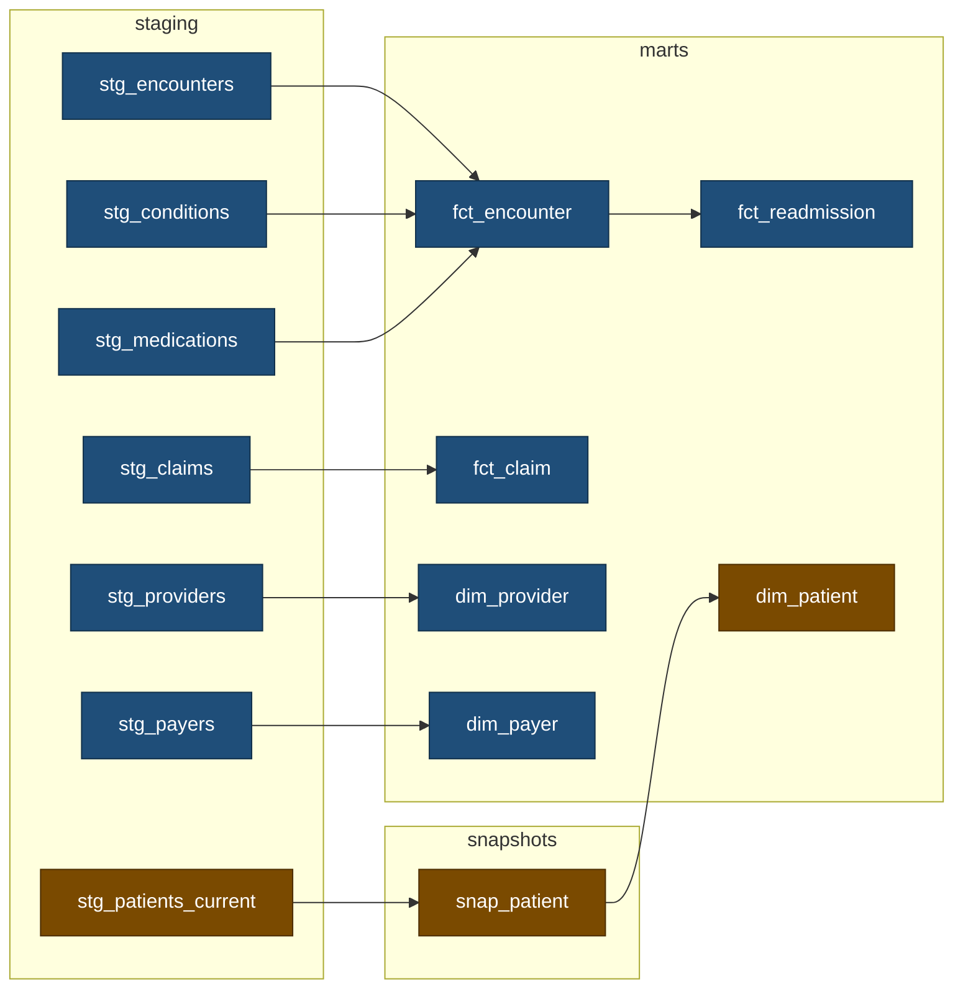
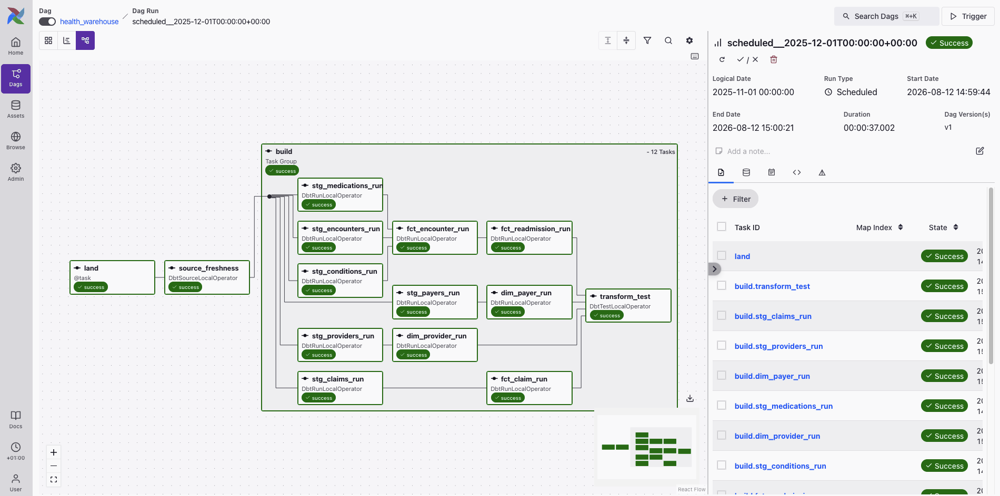
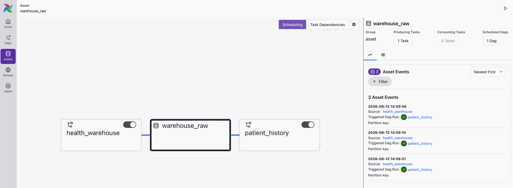

# Synthetic health warehouse

[](https://github.com/an-hill/synthetic-health-warehouse/actions/workflows/python-checks.yml) [](https://github.com/an-hill/synthetic-health-warehouse/actions/workflows/dbt.yml) [](https://github.com/an-hill/synthetic-health-warehouse/actions/workflows/airflow.yml)

An analytics pipeline over synthetic patient data: a windowed loader, a dbt star schema, and two Airflow DAGs. The domain was chosen for its awkwardness (and my experience working with it). Claims arrive weeks after the visit they bill for, records get restated, and patient attributes change. That is what makes incremental models, snapshots, and idempotent backfills necessary.

```
Synthea export ──→ loader ──→ raw ──→ staging ──→ marts
                (windowed)         (one view    (dims, facts,
                                    per source)  a readmission rate)
```

Data is [Synthea](https://github.com/synthetichealth/synthea), generated once and committed as Parquet: 554 patients, 31,824 encounters, and 60,828 claims running to the end of 2025, so no Java is needed to run any of this. `data/README.md` holds the provenance and the shape.

## What it aims to show

Five problems a warehouse over a live source has to solve:

- **Facts arrive late and get restated.** A merge per claim rather than a table-wide high-water mark, and why the cheaper filter is sound only until a window is re-landed.
- **Children fan out from the parent.** Aggregation to the encounter's grain first, and the version of the mistake that reconciles on every cost and is wrong only in the counts.
- **The source shows current state alone.** A type-2 snapshot, which attributes it can honestly carry, and a write guard where the damage cannot be undone.
- **A model can define a measure rather than reshape a table.** Boundary rules pinned by unit tests, and the answer pinned by a count that was not derived from the model.
- **Not every step can be rerun.** Two DAGs split by that property, and the concurrency settings that decide whether the history survives a backfill.

Every number below was measured, and several record a bug that produced a plausible answer and no error.

## Running it

Requires [uv](https://docs.astral.sh/uv/) and Python 3.13.

```sh
uv run python -m loader.land --window-start 1900-01-01 --window-end 2025-09-01 && make build
uv run python -m loader.land --window-start 2025-09-01 --window-end 2025-11-01 && make build
uv run python -m loader.land --window-start 2025-11-01 --window-end 2025-12-01 && make build
```

The first is the history load a pipeline runs on the day it is deployed. The other two are scheduled months. Building after each is what lets `snap_patient` record three separate as-of dates. The result is 31,611 encounters, 60,433 claims, and 567 patient versions over 554 patients.

`make` lists available targets. The ones worth knowing:

- `make build` builds the models and runs their tests.
- `make freshness` checks how recently the loader last wrote each raw table.
- `make docs` serves the model documentation and lineage graph on localhost:8080.
- `make check-windows` asserts what the second and third windows above should have produced, against counts fixed outside the dbt project.
- `make check-all` runs lint, typecheck, and tests, in the order they fail fastest.

For the orchestrated version, `astro dev start` needs Docker and brings Airflow up on localhost:6563 against its own warehouse under `include/`.

## The dbt project



Blue is built by `health_warehouse` and amber by `patient_history`. The orchestration section below explains the split. The seven raw tables are one view each and are left out of the diagram.

Four files carry most of the design:

- `transform/models/marts/fct_claim.sql`, the incremental filter, and why it compares per claim.
- `transform/macros/refuse_a_backwards_as_of_date.sql`, prevention where the damage cannot be undone.
- `dags/warehouse.py`, the one selector that splits the two DAGs.
- `scripts/check_warehouse.py`, the counts checked outside dbt, standing in for reconciliation against a system of record.

## Late arrival and the incremental model

Encounters are windowed on their service date. Claims are windowed on the date they were **billed**, a different window for the same visit. The lag is the export's own and is right-skewed the way a real one is: median 0, 95th percentile 6 days, and a tail out to 100.

The export holds no amendments, so restatement is injected by the loader: 5% of claims re-arrive 1 to 30 days later under the same `claim_id` with a changed amount, recorded in `meta.injection_log`. That makes `raw.claims` an append log, and collapsing 63,417 arrivals into 60,433 claims is `fct_claim`'s job, by a merge on the claim id.

The filter compares each arrival against the row held for that same claim, not against a table-wide high-water mark. The obvious alternative, `received_date > (select max(received_date) from {{ this }})`, prunes better but is correct only while windows land in ascending order and are never re-landed. If you land the same three windows in reverse it leaves only **422 claims out of 60,433**, because every earlier arrival sits behind the mark the latest window set. The per-claim comparison gives 60,433 either way.

Keeping the wrong arrival is invisible to every structural test: row count, grain, and uniqueness are correct whichever you keep. `meta.injection_log` is declared as a dbt source so that one test can reconcile the landed amounts against what was injected.

### Known limitation

A merge cannot delete, so re-landing a window that drops an arrival leaves the stale row in place. Filtering cannot solve this, because only the scheduler knows that this interval has been processed before and needs overwriting. The solution would be to delete the interval's slice of the target before the merge inserts, an `insert_overwrite` sitting on top of the merge rather than replacing it. The cost is a model that depends on being handed the right window, and nothing here would notice a wrong one.

## Fan-out and grain tests

Conditions and medications fan out from the encounter, averaging 1.58 and 2.02 rows at the encounters that record any. Joining both into `fct_encounter` directly turns 31,611 encounters into 61,812 rows and takes `sum(total_cost)` from **$95.8m to $450.9m**. The cost multiplies faster than the row count because the encounters that fan out hardest are the expensive ones, so reading the row count as a proxy for the damage would be wrong by a factor of 2.4. Aggregating each child to encounter grain first means it contributes one row and one number.

The "fix" worth fearing adds a `group by`. It restores the grain exactly, so the row count and every cost reconcile, and only the counts are wrong: 37,254 conditions against a true 19,883. Uniqueness, grain, and relationship tests all pass. `assert_child_counts_reconcile` totals the counts against the tables they came from, and it is the only check that catches this.

Claims fan out harder still, 1 to 46 per encounter, averaging 7.97 for an inpatient stay against 1.45 for an ambulatory visit. Their amounts apportion the encounter's cost. The last claim takes the remainder instead of its own rounded share, so per-encounter totals reconcile exactly. `fct_encounter` stores no claim rollup at all, because summing an append log would count a restatement twice and any total stored there would go stale as later claims arrive.

## Snapshots of mutating sources

A dbt snapshot detects change by comparing a source against what it saw last time, so it needs a source that mutates. Synthea hands over the opposite: dated history in a file that never changes. `raw.patients_current` throws that history away and holds every patient as they stood at the **window end**, replaced outright each run. The snapshot rediscovers the history one window at a time. Most operational sources really do show current state alone. The export is the odd one.

Two things move in the data export. The payer changes, resolved from the export's own coverage history rather than anything injected. Patients also die, and the row stays in the table with a flag set, so the snapshot sees a change rather than a row vanishing.

The snapshot checks birthdate, gender, race, ethnicity, and birthplace, none of which move in this export. They are carried because a real patient system corrects them, and a correction is dated by the day it arrives. Marital status, address, and income are left out because those change rather than get corrected, on a date a real system records and Synthea withholds. It gives one undated value per patient, and stamping that onto a row dated years earlier would make any date-aware join to `dim_patient` confidently wrong. The payer is carried because `payer_transitions.parquet` dates it.

`dim_patient` is a type-2 slowly changing dimension, one row per version of a patient rather than one row per patient. `dbt_valid_from` and `dbt_valid_to` bound the period each version was current for, so filtering on a date gives the version held then. It answers what the warehouse knew about a patient on that date, rather than what was true on it. The history only starts when the pipeline does, and the facts rebuild from raw each run, so a 2024 encounter landing in 2025 cannot be excluded from a 2024 answer. Carrying both axes is bitemporal modelling, which is not attempted here.

A snapshot that has written a false row cannot be repaired, because `--full-refresh` rebuilds from current state and discards every version captured so far. Landing an earlier window after a later one closes the open version at a timestamp before it began. Nothing inside dbt says so. A `pre_hook` compares the arriving as-of date against the history already held and fails the build before anything is written. Re-landing the latest window then recovers it.

`dim_patient` and `fct_readmission` carry enforced contracts, so a dropped column or a narrowed type fails the build naming it. The other four carry none, because nothing builds against them.

## The model that defines a measure

Every other mart reshapes a table. `fct_readmission` defines a measure, and it comes out at 613 index admissions and 125 readmissions. An index admission is an inpatient encounter discharged at least 30 days before the latest admission the warehouse holds. A readmission is the earliest later inpatient admission for the same patient, 1 to 30 days after that discharge. The rate itself is not stored, so a cut by payer or by year needs no new model.

A gap of 0 or less is a transfer, and admitting those would report 142. Day 30 counts because Synthea generates recurring admissions on near-monthly cycles, so 32 of the 125 sit exactly on it. Admissions discharged too near the end of the data are excluded entirely, because a rate over admissions that have not had time to be readmitted is biased downwards and gets trusted anyway.

`scripts/check_warehouse.py` holds the answer as two constants: 613 index admissions and 125 readmissions, counted from `data/encounters.parquet` independently of the model. `make check-windows` runs it against a built warehouse and fails when the model disagrees. It sits outside dbt because the model's own tests restate its rules, so they catch the model drifting from its rules but never the rules being wrong. A definition gets edited by changing the boundary in the model and in the test, and doing both leaves every dbt check green over 142 readmissions instead of 125. Four `unit_tests:` hold each exclusion above against fixture rows, one boundary apiece. They pin the rules, and the count pins the answer.

Two constants only work because the export never changes. Over live data the counts move daily, so an expected value goes stale overnight. A real warehouse reconciles against something with its own authority instead, such as a published test deck for the measure or the figure a regulator calculates and sends back. The check still has to come from outside the definition it is checking.

## Orchestration

Two DAGs, split by idempotency property. `health_warehouse` runs monthly, landing a window and building every model but the snapshot's. Airflow's data interval is a half-open date range exactly as `land_window` takes it, so the DAG does no date arithmetic of its own. `patient_history` runs the snapshot and `dim_patient`. An `Asset` the loader emits triggers it rather than the clock, and it sets `catchup=False`.



Every model rebuilds from raw and backfills freely, but the snapshot accumulates and cannot be repaired. Scheduling both from one DAG forces the weaker of the two onto the stronger. The split is one Cosmos selector, `stg_patients_current+`, excluded by the first DAG and selected by the second. No node is built twice, and no test runs in the DAG that lacks its model. The selector starts at the view the snapshot reads rather than at the snapshot itself. A boundary at `snap_patient` would leave the snapshot reading a relation the other DAG owns, and on a cold warehouse that relation is built after the snapshot has gone looking for it.

Both settings below were established by removing them and watching what came out. A `warehouse` pool of one slot holds the loader and every dbt task, because DuckDB takes a single writer between processes. Where the warehouse already exists the loser fails loudly. Where it does not, the lock lives *inside the file about to be created*, so two writers both acquire it, both commit, and the second to close leaves a file the other's window is missing from. Both tasks report success, each with an accurate count of the rows it did insert.

`max_active_runs=1` is there for the snapshot alone. A monthly schedule never has two intervals at once, so it is dormant outside a hand-run backfill. Raised to 3, all three windows still land in ascending order, because the pool grants slots in logical-date order, and every model comes out byte-identical. The snapshot is the casualty. At 3 it captures one as-of date, and `dim_patient` comes out at 554 rows with every version gone, under three green runs.

Backfilling the three monthly intervals from cold gives 564 patient versions dated 552, 8, and 4, identical to landing and building those windows one at a time, on four trials with no retries. Nothing in the wiring guarantees it. The asset releases the snapshot the moment `land` commits, and no dependency orders the consumer runs against the producer triggering them. It holds because one pool slot and one active run leave nothing to interleave. Widen either and the history goes first.



CI runs both DAGs with `airflow dags test` and then asserts on the warehouse they built. A run whose logical date falls outside the DAG's `end_date` succeeds having executed nothing at all.

## What of this would survive a real pipeline

**Unchanged.** The windowing contract, `land_window(start, end)` over a half-open interval, is how a real extract is parameterised from a scheduler's data interval. Delete on a partition predicate and then insert, all inside one transaction, is the idempotency and atomicity pattern any warehouse needs, and only the dialect changes. Deciding *which* date a row belongs to is a real decision that quietly breaks incremental models when it is wrong. A condition belongs to its parent encounter's date, and a claim to its billing date. Most of the tests survive too.

**Deleted.** The restatement injection and `meta.injection_log` go, because the export contains no amendments and a merge would otherwise have nothing to collapse. So does apportioning the encounter's cost across its claims, which is needed only because the 216 MB transactions file holding the real charges was left out. And `patients_current`'s as-of resolution, since a production source already shows current state.

**Replaced.** Eight lines. Every `read_parquet` call is the place a source connector goes, and nothing around them changes.

Nothing backs up `warehouse.duckdb` either, because it is derived and recovery means re-running the loader. That holds only because the source is immutable and complete. The window is the pretence that it is not. A real source ages records out, leaving the raw layer holding the only copy of what arrived. The usual answer is an immutable landing zone written once and never rewritten, and the committed Parquet is that in miniature.

## Limitations

- Synthea does not model readmission behaviour. Seven patients hold 20 or more inpatient stays and account for 110 of the 125. Another 79 inpatient encounters are a recurring detoxification regimen that a real measure would exclude as planned. The query is the deliverable. The rate is an artefact of the generator.
- A re-landed window can leave a stale row in `fct_claim`, as above. Stated, not fixed.
- dbt tasks are serialised because DuckDB is single-writer. A real warehouse would not need it.
- The history load hides the pipeline's own ragged leading edge. The claims orphan check reports zero, because every encounter the scheduled windows could bill for has been landed.
- No production scale, no cloud warehouse, no operational history.

## Versions run on

| Component | Version |
|---|---|
| Python | 3.13 |
| DuckDB | 1.5.5 |
| dbt-core, dbt-duckdb | 1.12.0, 1.10.1 |
| Airflow | 3.3.0, from Astro Runtime 3.3-2 |
| astronomer-cosmos | 1.15.1 |

Locked in `uv.lock`. The Astro image installs the same dependency groups the Makefile uses.

Dates are read in UTC, pinned in `profiles.yml` and in the loader's connection, because the export's timestamps carry a zone. The identical warehouse built under `TZ=Australia/Sydney` gives 127 readmissions and 387 differing rows, with every check green.

## Licence

MIT, covering the code. The export under `data/` is the output of [Synthea](https://github.com/synthetichealth/synthea), copyright The MITRE Corporation and released under Apache 2.0. `data/README.md` carries the terminology notices that travel with it. It is synthetic throughout and holds no patient information, real or reconstructable.

## Assistance

Developed with the assistance of [Claude Code](https://claude.com/claude-code). Every line of code and text in this repository was directed or reviewed by me personally.
