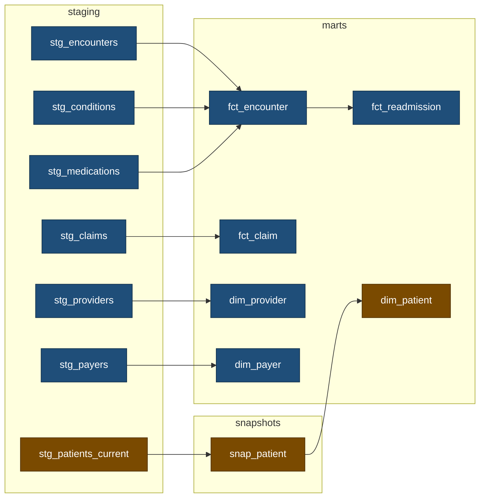

# Synthetic health warehouse

[](https://github.com/an-hill/synthetic-health-warehouse/actions/workflows/python-checks.yml) [](https://github.com/an-hill/synthetic-health-warehouse/actions/workflows/dbt.yml) [](https://github.com/an-hill/synthetic-health-warehouse/actions/workflows/airflow.yml)

An analytics pipeline over synthetic patient data: a windowed loader, a dbt star schema, and two Airflow DAGs. The domain was chosen for its awkwardness (and my experience working with it). Claims arrive weeks after the visit they bill for, records get restated, and patient attributes change, which is what makes incremental models, snapshots, and idempotent backfills necessary.

```
Synthea export ──→ loader ──→ raw ──→ staging ──→ marts
                (windowed)         (one view    (dims, facts,
                                    per source)  a readmission rate)
```

Data is [Synthea](https://github.com/synthetichealth/synthea), generated once and committed as Parquet: 554 patients, 31,824 encounters, and 60,828 claims running to the end of 2025, so no Java is needed to run any of this. `data/README.md` holds the provenance and the shape.

Every number below was measured, and several record a bug that produced a plausible answer and no error.

## Running it

Requires [uv](https://docs.astral.sh/uv/) and Python 3.13.

```sh
uv run python -m loader.land --window-start 1900-01-01 --window-end 2025-09-01 && make build
uv run python -m loader.land --window-start 2025-09-01 --window-end 2025-11-01 && make build
uv run python -m loader.land --window-start 2025-11-01 --window-end 2025-12-01 && make build
```

The first is the history load a pipeline runs on the day it is deployed; the other two are scheduled months. Building after each is what lets the snapshot see all three as-of dates. The result is 31,611 encounters, 60,433 claims, and 567 patient versions over 554 patients.

`make` lists the rest: `make docs` serves the lineage graph, `make check-all` runs lint, typecheck, and tests. For the orchestrated version, `astro dev start` needs Docker and brings Airflow up on localhost:6563 against its own warehouse under `include/`.

## The dbt project



Blue is built by `health_warehouse` and amber by `patient_history`, which is the whole of the DAG split; Orchestration below is why it falls there. The seven raw tables are one view each and are left out.

Four files carry most of the design, for reading code instead of prose:

- `transform/models/marts/fct_claim.sql`, the incremental filter, and why it compares per claim.
- `transform/macros/refuse_a_backwards_as_of_date.sql`, prevention where the damage cannot be undone.
- `dags/warehouse.py`, the one selector that splits the two DAGs.
- `scripts/check_warehouse.py`, the oracle that sits outside the project.

## Late arrival, and the incremental model

Encounters are windowed on their service date. Claims are windowed on the date they were **billed**, a different window for the same visit. The lag is the export's own and is right-skewed the way a real one is: median 0, 95th percentile 6 days, and a tail out to 100.

The export holds no amendments, so restatement is the one distortion injected: 5% of claims re-arrive 1 to 30 days later under the same `claim_id` with a changed amount, recorded in `meta.injection_log`. That makes `raw.claims` an append log, and collapsing 63,417 arrivals into 60,433 claims is `fct_claim`'s job, by a merge on the claim id.

The filter compares each arrival against the row held for that same claim, not against a table-wide high-water mark. The obvious alternative, `received_date > (select max(received_date) from {{ this }})`, prunes better and is sound only while windows land in ascending order and are never re-landed. Land the same three windows in reverse and it leaves **422 claims of 60,433**, silently, because every earlier arrival sits behind the mark the latest window set. The per-claim comparison gives 60,433 either way.

Keeping the wrong arrival is invisible to every structural test: row count, grain, and uniqueness are correct whichever you keep. `meta.injection_log` is declared as a dbt source so that one test can reconcile the landed amounts against what was injected, and it is the only check that fails.

A merge cannot delete, so re-landing a window that drops an arrival leaves the stale row in place with the counts still matching. No filter closes it, because the distinguishing fact is not in the batch: it is that this interval has been processed before, which only the scheduler knows.

## Fan-out, and the grain tests

Conditions and medications fan out from the encounter, averaging 1.58 and 2.02 rows at the encounters that record any. Joining both into `fct_encounter` directly turns 31,611 encounters into 61,812 rows and takes `sum(total_cost)` from **$95.8m to $450.9m**. The cost multiplies faster than the row count because the encounters that fan out hardest are the expensive ones, so reading the row count as a proxy for the damage would be wrong by a factor of 2.4. Aggregating each child to encounter grain first means it contributes one row and one number.

The version worth fearing adds a `group by`. It restores the grain exactly, so the row count and every cost reconcile, and only the counts are wrong: 37,254 conditions against a true 19,883. Uniqueness, grain, and relationship tests all pass over it. `assert_child_counts_reconcile` totals the counts against the tables they came from, and is the only check that catches it.

Claims fan out harder still, 1 to 46 per encounter, averaging 7.97 for an inpatient stay against 1.45 for an ambulatory visit. Their amounts apportion the encounter's cost, the last claim taking the remainder instead of its own rounded share, so per-encounter totals reconcile exactly. `fct_encounter` stores no claim rollup at all: summing an append log would count a restatement twice, and any total stored there would go stale as later claims arrive.

## A source that mutates, and the snapshot

A dbt snapshot detects change by comparing a source against what it saw last time, so it needs a source that mutates. Synthea hands over the opposite: dated history in a file that never changes. `raw.patients_current` throws that history away and holds every patient as they stood at the **window end**, replaced outright each run, so the snapshot rediscovers it one window at a time. Most operational sources really do show current state alone; the export is the odd one.

What moves is the payer, resolved from the export's own coverage history rather than anything injected, and death, where the patient stays in the table with a flag set so the snapshot sees a change and not a row vanishing.

It carries only attributes that can honestly be evaluated as of a date. Marital status, address, and income are fixed at generation time, so stamping them onto a row dated years earlier would make any date-aware join to `dim_patient` confidently wrong.

A snapshot that has written a false row cannot be repaired, because `--full-refresh` rebuilds from current state and discards every version captured so far. Landing an earlier window after a later one closes the open version at a timestamp before it began, and nothing inside dbt says so. A `pre_hook` compares the arriving as-of date against the history already held and fails the build before anything is written, which is what keeps the mistake recoverable by re-landing the latest window.

`dim_patient` and `fct_readmission` carry enforced contracts, so a dropped column or a narrowed type fails the build naming it. The other four carry none: nothing builds against them.

## The model that defines something

Every other mart reshapes a table. `fct_readmission` defines a measure: 613 index admissions and 125 readmissions, where an index admission is an inpatient encounter discharged at least 30 days before the latest admission the warehouse holds, and a readmission is the earliest later inpatient admission for the same patient, 1 to 30 days after that discharge. The rate is computed by whoever asks and not stored, so a cut by payer or by year needs no new model.

A gap of 0 or less is a transfer, and admitting those would report 142. Day 30 counts, which is not cosmetic: Synthea generates recurring admissions on near-monthly cycles, so 32 of the 125 sit exactly on it. Admissions discharged too near the end of the data are excluded entirely, because a rate over admissions that have not had time to be readmitted is biased downwards and gets trusted anyway.

A model that defines something needs an oracle; a model that reshapes something does not. Its own tests restate its rules, so they catch the model drifting from the rules and never the rules being wrong. Change the boundary in the model *and* in the test, which is how a definition actually gets edited, and every dbt check stays green over 142 readmissions instead of 125. `scripts/check_warehouse.py` pins the counts against a separate implementation and is the only thing that notices. Four `unit_tests:` hold each exclusion above against fixture rows, one boundary apiece: they pin the rules, and the count pins the answer.

Dates are read in UTC, pinned in `profiles.yml` and in the loader's connection, because the export's timestamps carry a zone: the identical warehouse built under `TZ=Australia/Sydney` gives 127 readmissions and 387 differing rows, with every check green.

## Orchestration

Two DAGs, split by idempotency property and not by subject area. `health_warehouse` lands a window and builds every model but the snapshot's, monthly, because Airflow's data interval is a half-open date range exactly as `land_window` takes it, so the DAG does no date arithmetic of its own. `patient_history` runs the snapshot and `dim_patient`, triggered by an `Asset` the loader emits instead of by the clock, with `catchup=False`.


Every model rebuilds from raw and backfills freely; the snapshot accumulates and cannot be repaired. Scheduling both from one DAG forces the weaker of the two onto the stronger. The split is one Cosmos selector, `stg_patients_current+`, excluded by the first DAG and selected by the second, so no node is built twice and no test runs in the DAG that lacks its model. It starts at the view the snapshot reads, not the snapshot itself: a boundary at `snap_patient` leaves it reading a relation the other DAG owns, which on a cold warehouse is built after the snapshot has gone looking for it.

Both settings below were established by removing them and watching what came out. A `warehouse` pool of one slot holds the loader and every dbt task, because DuckDB takes a single writer between processes. Where the warehouse already exists the loser fails loudly. Where it does not, the lock lives *inside the file about to be created*, so two writers both acquire it, both commit, and the second to close leaves a file the other's window is missing from. Both tasks report success, each with an accurate count of the rows it did insert.

`max_active_runs=1` is there for the snapshot alone. A monthly schedule never has two intervals at once, so it is dormant outside a hand-run backfill. Raised to 3, all three windows still land in ascending order, because the pool grants slots in logical-date order, and every model comes out byte-identical. The casualty is the snapshot: at 3 it captures one as-of date and `dim_patient` comes out at 554 rows with every version gone, under three green runs.

Backfilling the three monthly intervals from cold gives 564 patient versions dated 552, 8, and 4, identical to landing and building those windows one at a time, on four trials with no retries. Nothing in the wiring guarantees it. The asset releases the snapshot the moment `land` commits, and no dependency orders the consumer runs against the producer triggering them; it holds because one pool slot and one active run leave nothing to interleave. Widen either and the history goes first.


CI runs both DAGs with `airflow dags test` and then asserts on the warehouse they built, because a run whose logical date falls outside the DAG's `end_date` succeeds having executed nothing at all.

## What of this would survive a real pipeline

**Unchanged.** The windowing contract, `land_window(start, end)` over a half-open interval, is how a real extract is parameterised from a scheduler's data interval. Delete on a partition predicate and then insert, all inside one transaction, is the idempotency and atomicity pattern any warehouse needs, differing only in dialect. Deciding *which* date a row belongs to, a condition by its parent encounter and a claim by its billing date, is a real decision that quietly breaks incremental models when it is wrong. So are most of the tests.

**Deleted.** The restatement injection and `meta.injection_log`, which exist because the export contains no amendments and a merge would otherwise have nothing to collapse. Apportioning the encounter's cost across its claims, needed only because the 216 MB transactions file holding the real charges was left out. And `patients_current`'s as-of resolution, since a production source already shows current state and needs no help being flattened.

**Replaced.** Eight lines. Every `read_parquet` call is the seam where a source connector goes, and nothing around them changes.

Nothing backs up `warehouse.duckdb` either, because it is derived: recovery means re-running the loader. That holds only because the source is immutable and complete, the window being the pretence that it is not. A real source ages records out, leaving the raw layer holding the only copy of what arrived; the usual answer is an immutable landing zone written once and never rewritten, and the committed Parquet is that in miniature.

## Limitations

- Synthea does not model readmission behaviour. Seven patients hold 20 or more inpatient stays and account for 110 of the 125, and 79 of the inpatient encounters are a recurring detoxification regimen a real measure would exclude as planned. The query is the deliverable; the rate is an artefact of the generator.
- A re-landed window can leave a stale row in `fct_claim`, as above. Stated, not fixed.
- dbt tasks are serialised because DuckDB is single-writer. A real warehouse would not need it.
- The history load hides the pipeline's own ragged leading edge: the claims orphan check reports zero, because every encounter the scheduled windows could bill for has been landed.
- No production scale, no cloud warehouse, no operational history.

## Versions

Pinned deliberately. Airflow 3 changed scheduling semantics and `catchup` defaults, so version drift mid-project is an avoidable way to lose an afternoon.

| Component | Version |
|---|---|
| Python | 3.13 |
| DuckDB | 1.5.5 |
| dbt-core, dbt-duckdb | 1.12.0, 1.10.1 |
| Airflow | 3.3.0, from Astro Runtime 3.3-2 |
| astronomer-cosmos | 1.15.1 |

Locked in `uv.lock`. The Astro image installs the same dependency groups the Makefile uses, so there is no second place for a version to drift.

## Licence

MIT, covering the code. The export under `data/` is the output of [Synthea](https://github.com/synthetichealth/synthea), copyright The MITRE Corporation and released under Apache 2.0; `data/README.md` carries the terminology notices that travel with it. It is synthetic throughout and holds no patient information, real or reconstructable.

## Assistance

Developed with the assistance of [Claude Code](https://claude.com/claude-code). Every line of code and text in this repository was directed or reviewed by me personally.
